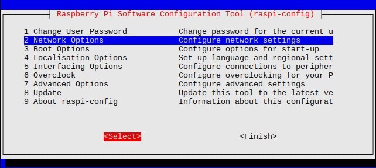
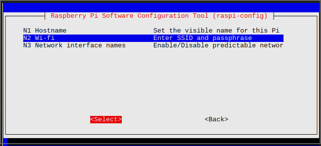

|Componente         |Version|Capacidad|
|-------------------|-------|---------|
|raspberryPi|4.B|***pendiente***|
|raspBian kernel|5.11|**no aplica**|
|debian|11|**no aplica**|
|pixhawk|2.4.8|**no aplica**|
|micro SD|no aplica|16|

# Proceso

1. Haciendo uso del programa  **raspberryPi imager** realizamos la correspondiente instalacion  del sistema operativo **raspBian**

2. Inicializamos la raspberryPi con la SD(con nuestro sistema instalado)

3. Ingresamos a las configuraciones del sistema y conectamos a la red wifi

~~~
    sudo raspi-config
~~~

> 

> 

> ingrosamos la red y la clave
